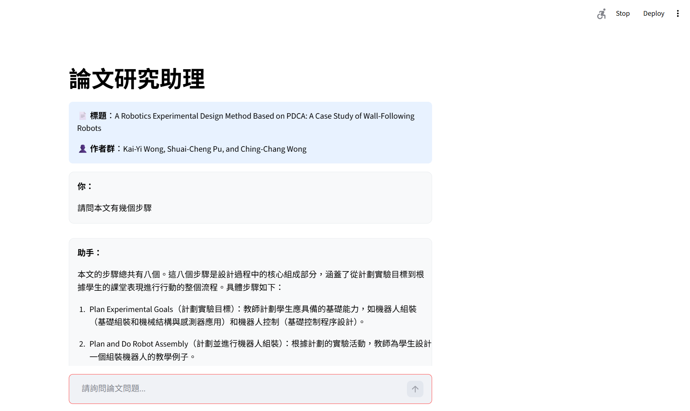
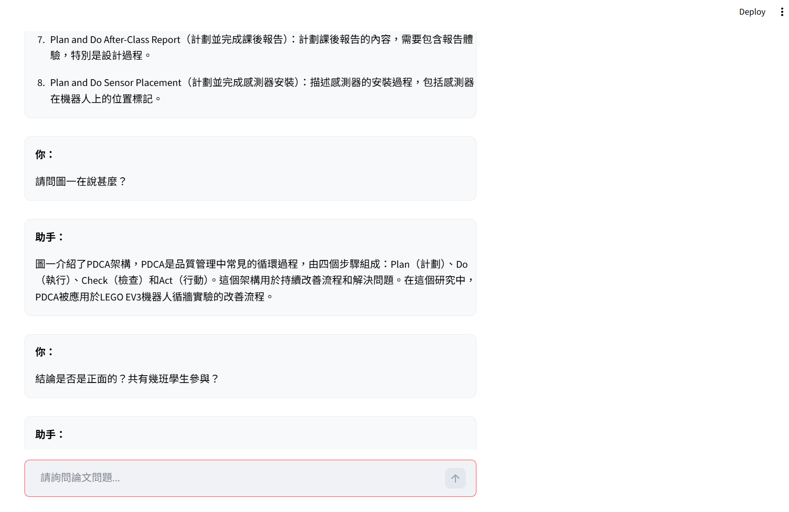
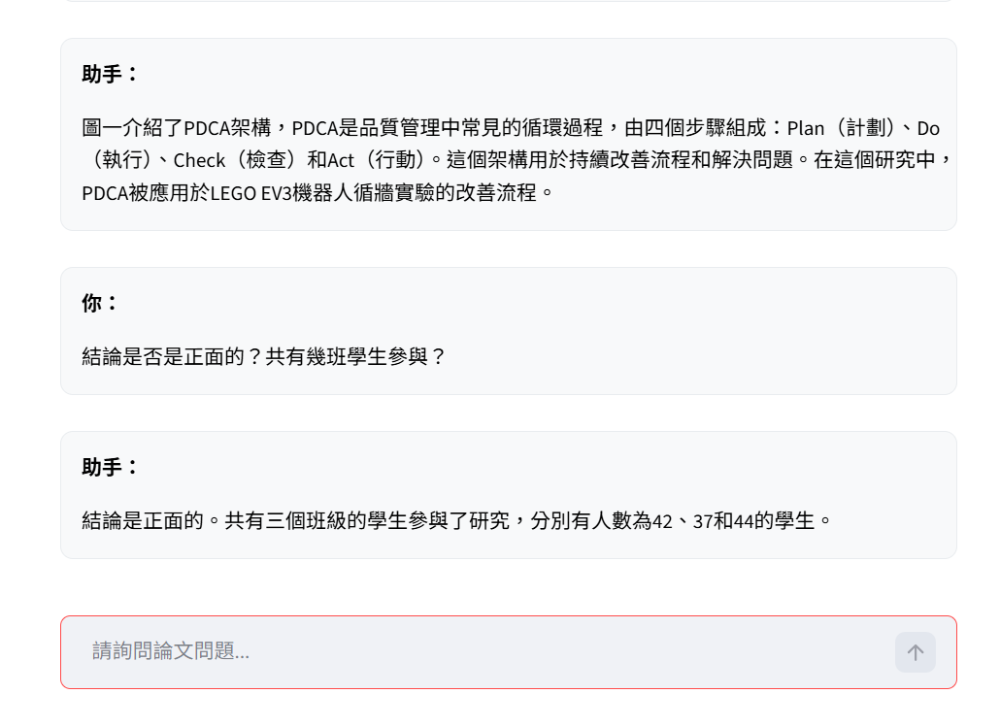

# RAG for 文字

# RAG for 圖片

# RAG for 多重問題

# Local Paper RAG Assistant

專為自身論文範例客製化的本地端 RAG 問答系統。
完全跑在 local 端。

## 專案特點

* **Metadata 強制鎖定**：直接在底層鎖死標題、作者（Kai-Yi Wong, Shuai-Cheng Pu, Ching-Chang Wong）與年份（2024），徹底解決 LLM 容易產生的作者排序與標題幻覺。
* **高強度檢索**：將向量檢索參數拉高（`k=20`），確保論文中後段的圖片說明（如 Figure 3）不漏接。
* **防幻覺機制**：Prompt 嚴格限制模型腦補（如憑空捏造電路或程式語法），查無資料強制回報未提及。
* **極簡 UI**：透過 CSS 強制覆寫 Streamlit 樣式，改為全白底黑字，並拔掉所有預設 Avatar，版面極度乾淨。

## 環境依賴

* Python 3.9+
* [Ollama](https://ollama.com/) (需在背景執行)

## 快速啟動

1. **安裝 Python 套件**：
   ```bash
   pip install -r requirements.txt

2. new terminal pull 千問
   ollama pull qwen2

3. interface.py第50行
   論文路徑更換: "C:\rag_local\paper\sensors-24-01869.pdf"   
4. 啟動本地rag
streamlit run interface.py

5. echo "Include/`nLib/`nScripts/`npyvenv.cfg`n__pycache__/`n*.pyc`nextracted_images/" > .gitignore